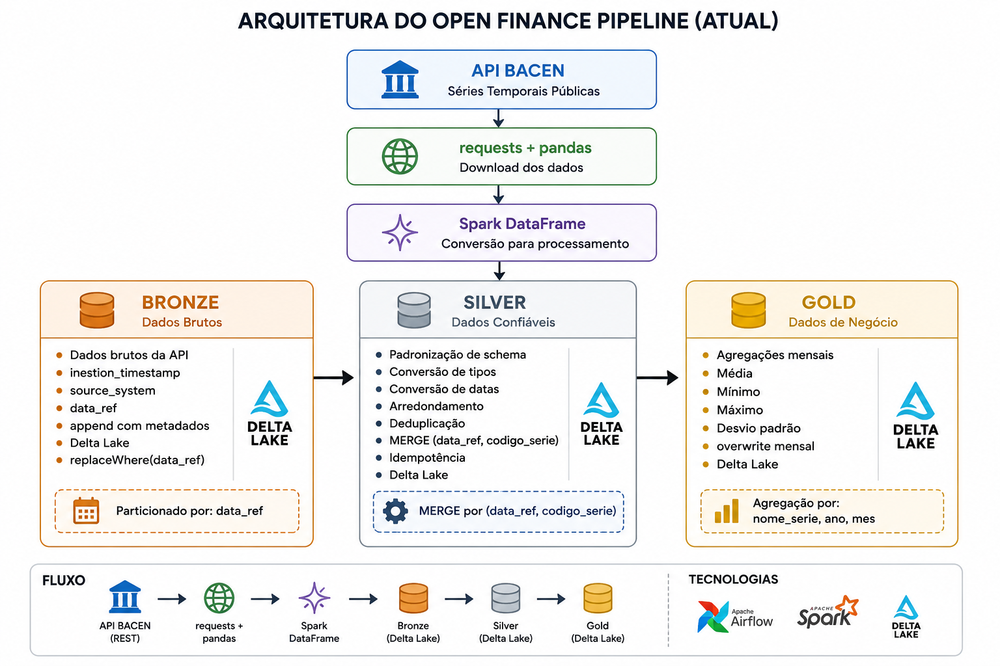

# Open Finance Pipeline

Pipeline de dados de indicadores financeiros públicos do 
Banco Central do Brasil, implementando arquitetura Medallion
com PySpark, Delta Lake e Apache Airflow.

## Arquitetura



## Séries processadas

| Série | Código BACEN | Frequência |
|-------|-------------|------------|
| Taxa Selic | 11 | Diária |
| IPCA | 433 | Mensal |
| Câmbio USD/BRL | 1 | Diária |

## Stack

- **PySpark** — processamento distribuído
- **Delta Lake** — storage ACID com time travel
- **Apache Airflow** — orquestração
- **GitHub Actions** — CI/CD
- **AWS S3** — data lake (produção)

## Como rodar localmente

```bash
# Clonar o repositório
git clone https://github.com/lleopsilva/open-finance-pipeline

# Instalar dependências
pip install -r requirements.txt

# Rodar testes
pytest tests/ -v

# Subir Airflow local
docker-compose up -d

# Testar extração da API BACEN
python -m src.extract.bacen_api
```

## Estrutura Medallion

### Bronze
- Dado bruto como chegou da API
- Metadados: `ingestion_timestamp`, `source_system`
- Idempotência: `replaceWhere` por `data_ref`

### Silver
- Dado limpo, tipado, deduplicado
- `data` convertida para `DateType`
- `valor` arredondado para 4 casas decimais
- Idempotência: MERGE por `(data, codigo_serie)`

### Gold
- Estatísticas mensais por série
- Colunas: `media_mensal`, `minimo_mensal`, `maximo_mensal`, `desvio_padrao`
- Idempotência: overwrite completo


## Qualidade de Dados

Cada camada possui um gate de qualidade automático:

| Check | Bronze | Silver | Gold |
|-------|--------|--------|------|
| Volume mínimo > 0 | ✅ | ✅ | ✅ |
| Nulos em `data` e `valor` | ✅ | ✅ | — |
| Valores negativos | — | ✅ | ✅ |
| Duplicatas por `(data, codigo_serie)` | — | ✅ | — |

Pipeline interrompido automaticamente se qualquer check crítico falhar.

## Decisões técnicas

**Por que Delta Lake em vez de Parquet puro?**
MERGE nativo para idempotência, time travel para auditoria,
e schema evolution sem reescrever arquivos.

**Por que broadcast join no Gold?**
A tabela de séries (dimensão) é pequena — broadcast elimina
shuffle desnecessário na tabela de fatos.

**Por que schedule semanal?**
IPCA é mensal, Selic e câmbio são diários mas para análise
estratégica semanal é suficiente. Em produção o schedule
seria configurável por série.